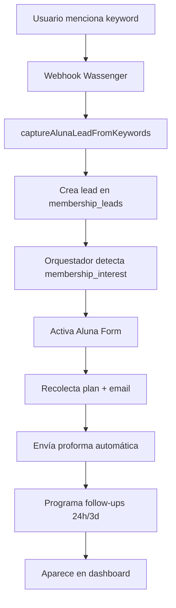

# Aluna Troubleshooting Skill

## Cuándo Usar Este Skill
- ❌ Keywords no capturan leads automáticamente
- ❌ Proforma no se envía cuando completamos email
- ❌ Follow-ups 24h o 3d no se disparan
- ❌ Dashboard no muestra leads nuevos
- ❌ Form de membresía no se activa
- ❌ Lead desaparece del dashboard

## Flujo Normal de Aluna



## Archivos Clave

### Frontend
- `public/aluna-proformas.html` - Dashboard de membresías
- `public/js/aluna-dashboard.js` - Renderizado + funciones helpers

### Backend Core
- `src/express-servidor/endpoints-api/wassenger.js` (línea ~2072)
  - **Captura automática de keywords**
  - Llamada a `captureAlunaLeadFromKeywords()`
  
- `src/database/alunaRepository.js`
  - `captureAlunaLeadFromKeywords()` - Crea lead automáticamente
  - `trackAlunaProspect()` - Registra para follow-ups
  - `findProspectsFor24hFollowUp()` - Prospectos que necesitan D+1
  - `findProspectsFor3dFollowUp()` - Prospectos que necesitan D+3

- `src/servicios/membership-form.js`
  - Formulario de recolección de datos
  - Validación de plan + email + teléfono

- `src/servicios/aluna-proforma-email.js`
  - `sendAlunaProforma()` - Envía email con proforma
  - Genera PDF con pricing
  - Guarda en `membership_leads`

### Dashboard API
- `src/express-servidor/endpoints-api/aluna-dashboard.js`
  - `GET /api/aluna/membership-leads` - Lista de leads
  - `POST /api/aluna/seed-demo-contacts` - Seed de prueba
  - `PUT /api/aluna/membership-leads/:id` - Update lead

### Database
- Tabla: `membership_leads` - Leads y prospectos
- Tabla: `aluna_prospect_followups` - Tracking de follow-ups
- Tabla: `users` - Usuarios asociados

## Keywords Activas

```javascript
const ALUNA_KEYWORDS = [
  'plan',
  'membresi',  // Captura: membresía, membresia, membership
  'mensual',
  'oficina',
  'cowork'
];
```

**Importante**: Keywords son **case-insensitive** y buscan **substring** (no palabra completa).

Ejemplos que capturan:
- ✅ "Quiero un **plan** mensual"
- ✅ "Info sobre **membresías**"
- ✅ "Cuánto cuesta la **oficina**?"
- ✅ "Qué es **coworking**?"

Ejemplos que NO capturan:
- ❌ "Quiero reservar" (eso es Aurora)
- ❌ "Hola" (sin keyword)
- ❌ "Gracias" (sin keyword)

## Puntos de Falla Comunes

### 1. Keyword No Captura Lead

**Síntoma**: Usuario dijo "membresía" pero no aparece lead en dashboard

**Debug**:
```javascript
// 1. Verificar que llegó al webhook:
[WASSENGER] Incoming: - Debe aparecer en logs

// 2. Verificar que llamó a captura:
[ALUNA-CAPTURE] - Debe aparecer

// 3. Si dice "No keywords, no crear lead":
→ El texto no contenía ninguna keyword
→ Verificar texto exacto que envió usuario
```

**Test Manual**:
```bash
# Simular mensaje con keyword:
curl -X POST http://localhost:3000/webhooks/wassenger \
  -H "Content-Type: application/json" \
  -d '{
    "event": "message:in:new",
    "data": {
      "fromNumber": "+593999999999",
      "body": "Hola, quiero un plan mensual",
      "fromName": "Test User"
    }
  }'

# Verificar en logs:
grep "ALUNA-CAPTURE" logs.txt
```

**Fix**:
```javascript
// Si keyword debería capturar pero no lo hace,
// verificar en wassenger.js línea ~2072:
captureAlunaLeadFromKeywords(userId, userName, processedText).catch(() => {});

// Asegurar que processedText tiene el texto completo
```

### 2. Proforma No Se Envía

**Síntoma**: Form completo (plan + email) pero proforma no llega

**Debug**:
```javascript
// Buscar en logs:
[ALUNA-PROFORMA] 💜 Proforma enviada - Si NO aparece, no se disparó

// Verificar condiciones en wassenger.js:
if (fd.membershipType && fd.email && !fd.proformaSent) {
  // Se dispara aquí
}

// Posibles causas:
1. fd.email está vacío o null
2. fd.membershipType no está seteado
3. fd.proformaSent ya es true (ya se envió antes)
```

**Test** Manual:
```sql
-- Ver si proforma fue marcada como enviada:
SELECT id, client_name, email, 
       notes,
       created_at
FROM membership_leads
WHERE email IS NOT NULL
ORDER BY created_at DESC
LIMIT 10;

-- Si notes contiene "Proforma enviada" → llegó al paso
-- Si no → nunca se llamó sendAlunaProforma()
```

**Fix**:
```javascript
// Reenviar proforma manualmente:
const { sendAlunaProforma } = await import('./aluna-proforma-email.js');

await sendAlunaProforma({
  clientName: 'Juan Pérez',
  clientEmail: 'juan@example.com',
  planKey: 'hotdesk', // o 'coworking', 'privada', etc
  fromAdmin: false
});
```

### 3. Follow-up 24h No Se Envía

**Síntoma**: Pasaron 24h desde interest_at pero no recibió mensaje

**Debug**:
```sql
-- Ver prospectos que deberían recibir D+1:
SELECT user_phone, user_name,
       interest_at,
       followup_24h_sent_at,
       NOW() - interest_at as time_since_interest
FROM aluna_prospect_followups
WHERE followup_24h_sent_at IS NULL
  AND converted_at IS NULL
  AND interest_at <= NOW() - INTERVAL '24 hours';
```

**Verificar Cron Job**:
```bash
# Logs al inicio del servidor:
[CRON] 📅 Follow-up automático: cada 30 minutos

# Si NO aparece → cron no está activo
# Revisar src/servicios/cron-jobs.js

# Ver última ejecución:
heroku logs --tail | grep "FOLLOW-UP"
```

**Fix Manual**:
```javascript
// Disparar follow-up manualmente:
const { sendAlunaFollowUp24h } = await import('./follow-up-service.js');

await sendAlunaFollowUp24h({
  userPhone: '+593...',
  userName: 'Juan',
  membershipType: 'coworking'
});

// Marcar como enviado:
UPDATE aluna_prospect_followups
SET followup_24h_sent_at = NOW()
WHERE user_phone = '+593...';
```

### 4. Dashboard Vacío

**Síntoma**: Hay leads en DB pero dashboard muestra 0

**Debug**:
```sql
-- Verificar que hay datos:
SELECT COUNT(*) FROM membership_leads;

-- Si hay datos, problema es frontend/API
-- Verificar endpoint:
curl http://localhost:3000/api/aluna/membership-leads
```

**Errores Comunes**:
```javascript
// 1. CORS bloqueando petición
→ Ver console del browser: "blocked by CORS policy"

// 2. API returna error:
{"ok": false, "error": "..."}

// 3. SQL query fallando:
→ Buscar [ALUNA-DASH] en logs backend
```

**Fix**:
```javascript
// Verificar en aluna-dashboard.js endpoint:
const response = await fetch('/api/aluna/membership-leads');
if (!response.ok) {
  console.error('Error cargando leads:', response.status);
}

// Verificar permisos de SELECT en postgres-adapter.js
```

### 5. Lead Desaparece

**Síntoma**: Lead estaba en dashboard, ahora no aparece

**Debug**:
```sql
-- Buscar lead por teléfono o nombre:
SELECT * FROM membership_leads
WHERE client_name ILIKE '%juan%'
   OR phone LIKE '%593%';

-- Ver si fue eliminado (si tienes soft delete):
SELECT * FROM membership_leads
WHERE deleted_at IS NOT NULL;
```

**Causas Comunes**:
```
1. Status cambió a uno que no se muestra en dashboard
2. Lead fue marcado como spam/test
3. Update accidental cambió datos
4. Bug en filtro del dashboard (verificar SQL WHERE)
```

## Queries SQL Útiles

### Ver Leads Calientes (Últimos 7d)
```sql
SELECT id, client_name, phone, status,
       monthly_fee, membership_type,
       last_interaction_at,
       created_at
FROM membership_leads
WHERE last_interaction_at > NOW() - INTERVAL '7 days'
  AND status IN ('pending', 'negotiating', 'tour_scheduled')
ORDER BY last_interaction_at DESC;
```

### Ver Prospectos Sin Follow-up 24h
```sql
SELECT user_phone, user_name,
       membership_type,
       interest_at,
       NOW() - interest_at as tiempo_transcurrido
FROM aluna_prospect_followups
WHERE followup_24h_sent_at IS NULL
  AND converted_at IS NULL
  AND interest_at <= NOW() - INTERVAL '24 hours'
ORDER BY interest_at;
```

### Ver Prospectos Sin Follow-up 3d
```sql
SELECT user_phone, user_name,
       followup_24h_sent_at,
       NOW() - followup_24h_sent_at as tiempo_desde_d1
FROM aluna_prospect_followups
WHERE followup_24h_sent_at IS NOT NULL
  AND followup_3d_sent_at IS NULL
  AND converted_at IS NULL
  AND followup_24h_sent_at <= NOW() - INTERVAL '72 hours'
ORDER BY followup_24h_sent_at;
```

### Ver Captura de Keywords Última Hora
```sql
SELECT id, client_name, phone,
       notes,
       created_at
FROM membership_leads
WHERE notes LIKE '%Keywords:%'
  AND created_at > NOW() - INTERVAL '1 hour'
ORDER BY created_at DESC;
```

### Ver Automatizaciones Enviadas
```sql
SELECT id, client_name, phone, status,
       automation_d1_sent, automation_d3_sent,
       followup_24h_sent_at, followup_3d_sent_at,
       client_whatsapp_reply, client_email_reply
FROM membership_leads
WHERE automation_d1_sent = TRUE
   OR automation_d3_sent = TRUE
ORDER BY followup_24h_sent_at DESC NULLS LAST
LIMIT 50;
```

## Testing Manual

### Test Completo de Captura
```
1. Enviar mensaje con keyword:
   "Hola, me interesa un plan de coworking mensual"

2. Verificar captura:
   → Dashboard muestra nuevo lead en < 10 seg
   → Lead tiene status='pending'
   → notes contienen "Keywords: plan, cowork, mensual"

3. Verificar form activado:
   → Aluna pregunta por detalles
   → Completa form con plan + email

4. Verificar proforma:
   → Email llega a bandeja (revisar spam)
   → PDF adjunto correcto

5. Verificar follow-up:
   → 24h después, mensaje D+1
   → 3d después del D+1, mensaje D+3
```

### Test de Rollback
```sql
-- Eliminar lead de prueba:
DELETE FROM membership_leads
WHERE id = 'ML-WS-...';

-- Eliminar tracking de follow-up:
DELETE FROM aluna_prospect_followups
WHERE user_phone = '+593...';
```

## Schema Actualizado (18 Mar 2026)

```sql
-- Campos nuevos en membership_leads:
automation_d1_sent BOOLEAN DEFAULT FALSE
automation_d3_sent BOOLEAN DEFAULT FALSE
followup_24h_sent_at TIMESTAMP
followup_3d_sent_at TIMESTAMP
last_interaction_at TIMESTAMP
client_response_at TIMESTAMP
client_whatsapp_reply BOOLEAN DEFAULT FALSE
client_email_reply BOOLEAN DEFAULT FALSE
```

**Uso**:
- `automation_d1_sent`: Marca si D+1 ya fue enviado
- `last_interaction_at`: Última vez que hubo contacto (para color-coding en dashboard)
- `client_whatsapp_reply`: Usuario respondió por WhatsApp
- `client_email_reply`: Usuario respondió por email

## Dashboard - Columnas Nuevas

```javascript
// Automatizaciones:
getAutomationStatus(lead) {
  const d1 = lead.automation_d1_sent ? '✓ D+1' : '○ D+1';
  const d3 = lead.automation_d3_sent ? '✓ D+3' : '○ D+3';
  return `${d1} ${d3}`;
}

// Último Contacto:
getTimeSinceLastContact(lead) {
  const hours = hoursSince(lead.last_interaction_at);
  if (hours < 24) return '🟢 Hoy';
  if (hours < 72) return '🟡 Hace 3d';
  return '🔴 Hace 12d';
}

// Interacción Cliente:
getClientInteraction(lead) {
  if (lead.client_whatsapp_reply) return '📱 WhatsApp';
  if (lead.client_email_reply) return '📧 Email';
  return 'Sin respuesta';
}
```

## Logs a Monitorear

```bash
# Ver captura de keywords:
heroku logs --tail | grep "ALUNA-CAPTURE"

# Ver proformas enviadas:
heroku logs --tail | grep "ALUNA-PROFORMA"

# Ver follow-ups:
heroku logs --tail | grep "FOLLOW-UP"

# Ver forms de membresía:
heroku logs --tail | grep "ALUNA-FORM"

# Errores:
heroku logs --tail | grep -E "(ERROR|❌)" | grep -i aluna
```

## Escalation Path

1. **Verificar logs** primero
2. **Query manual** en DB para confirmar estado
3. **Test con lead de prueba** (tu propio número)
4. **Rollback** si bug reciente
5. **Restart** cron jobs si follow-ups atascados

## Variables Críticas

```bash
WASSENGER_TOKEN=...           # Para webhook
OPENAI_API_KEY=...            # GPT para Aluna
MAILER_PASS=...               # Envío de proformas
DATABASE_URL=...              # PostgreSQL
```

## Métricas de Éxito

✅ **Captura**:
- Keywords detectan 100% de menciones
- Lead creado en < 2 segundos

✅ **Proforma**:
- Envío automático cuando hay plan + email
- Llega a bandeja en < 30 segundos

✅ **Follow-ups**:
- D+1 enviado 24-25h después
- D+3 enviado 72-73h después
- 0 duplicados
