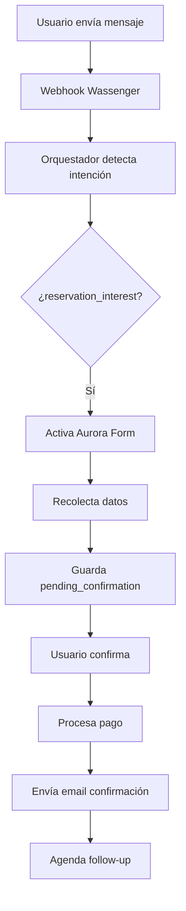

# Aurora Troubleshooting Skill

## Cuándo Usar Este Skill
- ❌ Cliente reporta que no recibió confirmación de reserva
- ❌ Webhook de Wassenger no triggerea Aurora
- ❌ Formulario de reserva no se activa
- ❌ Email de confirmación no llega
- ❌ Pago procesado pero no refleja en sistema
- ❌ Follow-up automático no se envía

## Flujo Normal de Aurora



## Archivos Clave

### Frontend
- `public/aurora-reservas.html` - Dashboard de reservas
- `public/js/aurora-dashboard.js` - Lógica del dashboard

### Backend Core
- `src/express-servidor/endpoints-api/wassenger.js` (líneas 1800-2200)
  - Webhook principal
  - Detección de intención
  - Activación de forms
  
- `src/servicios/partial-reservation-form.js`
  - Lógica del formulario de reserva
  - Recolección de datos (fecha, hora, personas, plan)
  
- `src/servicios/reservation-state.js`
  - `getPendingConfirmation()` - Leer confirmación pendiente
  - `clearPendingConfirmation()` - Limpiar después de procesar
  - `clearJustConfirmed()` - Limpiar flag de confirmación

### Detección de Intenciones
- `src/deteccion-intenciones/orquestador.js`
  - Punto de entrada principal
  - Decide qué agente maneja el mensaje
  
- `src/deteccion-intenciones/intent-resolver-v2.js`
  - `resolveIntent()` - Clasifica intención del mensaje
  - `decideResponder()` - Determina si Aurora o Gabi responden

### Database
- `src/database/database.js`
  - Tabla: `reservations` - Reservas confirmadas
  - Tabla: `pending_confirmations` - Confirmaciones esperando aprobación
  - Tabla: `users` - Usuarios con horas disponibles

## Puntos de Falla Comunes

### 1. Form No Se Activa

**Síntoma**: Usuario pregunta por reserva pero no se activa formulario

**Debug**:
```javascript
// Verificar en logs:
[AURORA-FORM] - Debería aparecer cuando se activa

// Si no aparece, revisar:
1. ¿El orquestador detectó la intención?
   → Buscar [INTENT-RESOLVER] en logs
   
2. ¿Hay form activo de otro agente?
   → const activeForm = await getAgentForm(userId, 'AURORA')
   → Si hay form de ALUNA o GABI, puede bloquear
   
3. ¿Usuario está en cooldown?
   → Revisar rate limiting en logs
```

**Fix**:
```javascript
// Limpiar form stuck:
await clearAgentForm(userId, 'ALUNA'); // o el agente que esté bloqueando
```

### 2. Confirmación Perdida

**Síntoma**: Usuario dice "sí confirmo" pero no procesa

**Debug**:
```sql
-- Ver confirmaciones pendientes:
SELECT * FROM pending_confirmations 
WHERE user_phone = '+593...' 
  AND agent_type = 'AURORA';

-- Ver si expiró:
SELECT *, 
       expires_at < NOW() as expired
FROM pending_confirmations 
WHERE user_phone = '+593...';
```

**Fix**:
```javascript
// En wassenger.js buscar:
const pending = await getPendingConfirmation(userId);
if (!pending) {
  console.log('[CONFIRMATION] No hay confirmación pendiente para', userId);
  // El problema está aquí - confirmar por qué no hay pending
}
```

### 3. Email No Llega

**Síntoma**: Reserva procesada pero email no enviado

**Debug**:
```javascript
// Buscar en logs:
[MAILER] - Estado del envío
[MAILER] ❌ - Errores

// Verificar:
1. Nodemailer configurado: process.env.MAILER_PASS
2. Email del cliente válido: verificar en users table
3. Email no en carpeta spam del cliente
```

**Test Manual**:
```bash
# En Heroku:
heroku config:get MAILER_PASS --app coworkia-agent

# Debería retornar la app password de Gmail
# Si es null → problema de configuración
```

**Fix**:
```javascript
// Reenviar email manualmente desde endpoint:
POST /api/aurora/resend-confirmation
{
  "userId": "+593...",
  "reservationId": "RES-..."
}
```

### 4. Webhook Duplicado

**Síntoma**: Cliente recibe respuesta duplicada

**Debug**:
```javascript
// Buscar en logs:
[DEDUP] 🚫 Mensaje duplicado - Si aparece, está funcionando
[DEDUP] ⏭️ Ignorando webhook duplicado

// Si NO aparece pero hay duplicados:
1. Verificar isDuplicateMessage() en wassenger.js
2. Revisar Map de processedMessages
3. TTL configurado: MESSAGE_DEDUP_TTL_MS = 60000
```

### 5. Follow-up No Se Envía

**Síntoma**: 24h después de reserva, no llega recordatorio

**Debug**:
```sql
-- Ver follow-ups pendientes:
SELECT r.*, 
       r.fecha_hora - INTERVAL '24 hours' as followup_trigger_time,
       NOW()
FROM reservations r
WHERE r.flag_24h = FALSE
  AND r.fecha_hora > NOW()
  AND r.fecha_hora - INTERVAL '24 hours' <= NOW();
```

**Fix**:
```javascript
// Verificar cron job activo:
// Buscar en logs al inicio:
[CRON] 📅 Follow-up automático: cada 30 minutos

// Si no aparece, cron no está corriendo
// Revisar src/servicios/cron-jobs.js
```

## Queries SQL Útiles

### Ver Reservas de Hoy
```sql
SELECT r.*, u.nombre, u.phone_number
FROM reservations r
JOIN users u ON r.user_id = u.id
WHERE DATE(r.fecha_hora) = CURRENT_DATE
ORDER BY r.fecha_hora;
```

### Ver Confirmaciones Pendientes
```sql
SELECT * FROM pending_confirmations
WHERE agent_type = 'AURORA'
  AND expires_at > NOW()
ORDER BY created_at DESC;
```

### Ver Usuarios con Form Activo
```sql
SELECT user_phone, agent_name, 
       created_at, expires_at
FROM agent_forms
WHERE agent_name = 'AURORA'
  AND expires_at > NOW();
```

### Ver Errores Recientes
```sql
SELECT * FROM error_logs
WHERE error_message LIKE '%AURORA%'
  OR error_message LIKE '%reservation%'
ORDER BY created_at DESC
LIMIT 20;
```

## Testing Manual

### 1. Test Completo de Reserva
```
1. Enviar a WhatsApp (+593994837117):
   "Hola, quiero reservar para mañana"

2. Verificar respuesta de Aurora en < 3 seg

3. Completar formulario:
   - Fecha
   - Hora
   - Número de personas
   - Plan (hot desk, day pass, etc)

4. Confirmar con "sí"

5. Verificar:
   ✓ Email llegó
   ✓ Reserva en DB
   ✓ Horas descontadas (si aplica)
```

### 2. Test de Rollback
```sql
-- Si algo salió mal, rollback de reserva:
BEGIN;

-- Eliminar reserva
DELETE FROM reservations WHERE id = 'RES-XXX';

-- Restaurar horas (si se descontaron)
UPDATE users 
SET horas_disponibles = horas_disponibles + 4
WHERE id = 123;

COMMIT; -- o ROLLBACK si no estás seguro
```

## Logs a Monitorear

```bash
# Ver logs en tiempo real:
heroku logs --tail --app coworkia-agent | grep -E "(AURORA|RESERVATION|CONFIRM)"

# Filtrar solo errores:
heroku logs --tail --app coworkia-agent | grep "❌"

# Últimos 1000 logs:
heroku logs -n 1000 --app coworkia-agent > aurora-logs.txt
```

## Escalation Path

1. **Ver logs** primero siempre
2. **Verificar health**: https://coworkia-agent-e97d15dac56f.herokuapp.com/health
3. **Rollback** si es bug reciente: `heroku rollback v976`
4. **Restart** app: `heroku restart --app coworkia-agent`
5. **Manual fix** en DB si es dato corrupto

## Variables de Entorno Críticas

```bash
WASSENGER_TOKEN=...           # WhatsApp API
WASSENGER_DEVICE_ID=...       # Device ID
OPENAI_API_KEY=...            # GPT para Aurora
MAILER_PASS=...               # Gmail app password
DATABASE_URL=...              # PostgreSQL Heroku
ADMIN_PHONE=...               # Tu número para comandos
```

## Contactos de Emergencia

- **Wassenger**: Token válido hasta 2027
- **OpenAI**: Límite 10,000 req/min
- **Heroku**: Dyno Professional ($50/mes)
- **Gmail**: App password renovar cada 6 meses
